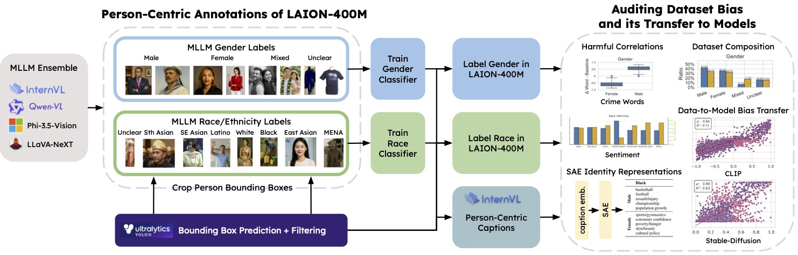

<div align="center">
    
# Person-Centric Annotations of LAION-400M
### Auditing Bias and Its Transfer to Models

_Accepted at ICLR 2026_

[](https://arxiv.org/pdf/2510.03721)
[](https://openreview.net/forum?id=t3ZMiHhqXm)
[](https://huggingface.co/collections/LGirrbach/laion400m-person-centric-annotations)

<br/>

Leander Girrbach<sup>1,3</sup> &#8198; Stephan Alaniz<sup>2</sup> &#8198; Genevieve Smith<sup>4</sup> &#8198; Trevor Darrell<sup>4</sup> &#8198; Zeynep Akata<sup>1,3</sup>

<small>
<sup>1</sup>Technical University of Munich, Munich Center for Machine Learning (MCML) &#8198; <sup>2</sup>LTCI, Télécom Paris, Institut Polytechnique de Paris, France &#8198; <sup>3</sup> Helmholtz Munich &#8198; <sup>4</sup> University of California, Berkeley
</small>
</div>

<br/>

## Highlights

✨ **Unprecedented Scale:** We create **276M+** person bounding boxes and **199M+** perceived demographic labels (gender & race/ethnicity) for LAION-400M.

✨ **Bias Transfer:** We show that **60-70%** of gender bias in downstream models (CLIP, Stable Diffusion) can be linearly predicted directly from dataset co-occurrences.

✨ **Granular Auditing:** Our annotations enable web-scale audit of harmful correlations (e.g., crime, negative sentiment) at a person-centric level rather than a holistic image level.

✨ **Rich Analysis and Metadata:** Includes detailed, MLLM-generated person-centric captions and Sparse Autoencoder (SAE) analyses to uncover thematic associations.

---


**Overview of our annotation workflow:** We detect $\sim$ 200M person bounding boxes with YOLO11. An MLLM ensemble (Phi-3.5-Vision, LLaVA-NeXT, InternVL3) provides gender and race/ethnicity labels on sampled subsets, and only consensus predictions are used to train SigLIP classifiers. These classifiers then label the full dataset, while InternVL3 generates person-centric captions. The resulting annotations enable systematic analysis of dataset composition, harmful correlations, and bias transfer to downstream models.

---

## Introduction

This repository contains the codebase for **Person-Centric Annotations of LAION-400M**. By creating extensive, high-quality annotations for the full dataset, we address a critical gap in AI fairness research: determining the extent to which model bias is a direct consequence of massive, uncurated pretraining data.

Our pipeline utilizes a validated ensemble of MLLMs and fine-tuned classifiers to infer:
* **Bounding Boxes:** 276,824,258 detections using YOLO11.
* **Demographics:** 199,931,986 labels for perceived binary gender and race/ethnicity.
* **Captions:** Detailed descriptions generated for each detected person.

These resources allow researchers to link dataset statistics to downstream model behavior, providing precise queries about visually depicted groups that were previously impossible at web scale.

 * **Paper**: [https://arxiv.org/pdf/2510.03721](https://arxiv.org/pdf/2510.03721)
 * **Data**: [https://huggingface.co/collections/LGirrbach/laion400m-person-centric-annotations](https://huggingface.co/collections/LGirrbach/laion400m-person-centric-annotations)

 **Important Note**: Gender and race/ethnicity annotations are gated due to their sensitive nature and will only be made available upon request.

## Codebase Overview

### 1. Annotation Pipeline
*Scripts used to detect, label, and caption individuals in the dataset.*

| Script | Function | Paper Reference |
| :--- | :--- | :--- |
| `person_detection.py` | **Detection:** Detects bounding boxes using YOLO11-l; filters by confidence. | §3: Bounding Boxes |
| `gender_labeling_mllm.py` | **Labeling:** Generates ground-truth gender labels via MLLM ensemble (InternVL3, Phi-3.5, LLaVA). | §3: Gender Labels |
| `train_gender_classifier.py` | **Training:** Fine-tunes SigLIP classifier on consensus gender labels (97.2% acc). | §3: Gender Classifier |
| `gender_labeling_classifier.py` | **Inference:** Applies trained gender classifier to the full LAION-400M dataset. | §3: Full Labeling |
| `race_labeling_mllm.py` | **Labeling:** Generates ground-truth race/ethnicity labels via MLLM ensemble. | §3: Race Labels |
| `train_race_classifier.py` | **Training:** Fine-tunes SigLIP classifier for 7 race/ethnicity categories. | §3: Race Classifier |
| `race_labeling_classifier.py` | **Inference:** Applies trained race classifier to valid bounding boxes. | §3: Full Labeling |
| `person_captioning.py` | **Captioning:** Generates detailed person-centric captions using InternVL3-8B. | §3: Captions |

### 2. Analysis & Auditing
*Scripts used to measure bias, analyze themes, and evaluate models.*

| Script | Function | Paper Reference |
| :--- | :--- | :--- |
| `sentiment_analysis.py` | **Audit:** Analyzes sentiment (VADER) and hate speech correlations in alt-text. | §4.2: Correlations |
| `person_caption_embeddings.py`| **Embed:** Embeds captions using Granite for SAE analysis. | §4.3: SAE Analysis |
| `train_sae.py` | **Topics:** Trains Sparse Autoencoders to discover recurring identity themes. | §4.3: SAE Analysis |
| `clip_embed_person.py` | **Transfer:** Computes CLIP embeddings to measure dataset-to-model bias transfer. | §5: Bias Transfer |
| `stable_diffusion.py` | **Generative:** Generates SD images to analyze bias in single-person generations. | §5: SD Bias |

### 3. Utilities
| Module | Description |
| :--- | :--- |
| `utils/laion_reader.py` | Efficient dataloading for LAION tarballs with bounding box support. |
| `utils/dictionary_learning/` | Infrastructure for SAE training (trainers, buffers, evaluation). |
| `lexical_data/` | Vocabularies for crime words, social categories, and topic labels. |

---

## Citation

If you use this codebase or the data in your research, please cite our paper:

```bibtex
@inproceedings{girrbach2026person,
  title={Person-Centric Annotations of LAION-400M: Auditing Bias and its Transfer to Models},
  author={Girrbach, Leander and Alaniz, Stephan and Smith, Genevieve and Darrell, Trevor and Akata, Zeynep},
  booktitle={International Conference on Learning Representations (ICLR)},
  year={2026}
}
```

## Contact

If you have any questions, please open an issue on this repository. We'll get back to you as soon as possible!

## Acknowledgements

This work was partially funded by the ERC (853489 - DEXIM), the Alfried Krupp von Bohlen und Halbach Foundation and Berkeley AI Research (BAIR) Commons. The authors gratefully acknowledge the scientific support and resources of the AI service infrastructure LRZ AI Systems provided by the Leibniz Supercomputing Centre (LRZ) of the Bavarian Academy of Sciences and Humanities (BAdW), funded by Bayerisches Staatsministerium für Wissenschaft und Kunst (StMWK). The authors also acknowledge the use of the HPC cluster at Helmholtz Munich for the computational resources used in this study.

SAE training code was adapted from the [Dictionary Learning Library](https://github.com/saprmarks/dictionary_learning). Shout out to the maintainers for the great work!